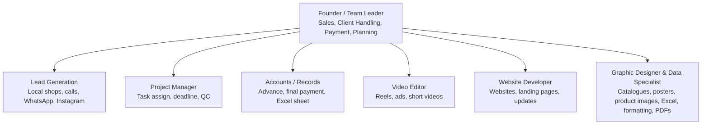

## Hi there 👋

# nexus-devs-innovations

Welcome to the **nexus-devs-innovations** GitHub Organization profile.  
We are a **7-member team** focused on client delivery, digital services, and creative execution.

## Team Structure

## Project Process / Workflow (11 Steps)

```mermaid
flowchart LR
    S1[1. Lead Found] --> S2[2. Client Contacted]
    S2 --> S3[3. Requirement Understood]
    S3 --> S4[4. Quotation Sent]
    S4 --> S5[5. 50% Advance Received]
    S5 --> S6[6. Task Assigned to Specialist]
    S6 --> S7[7. Work Completed]
    S7 --> S8[8. Quality Check by Leader/PM]
    S8 --> S9[9. Client Revision & Approval]
    S9 --> S10[10. Final Payment]
    S10 --> S11[11. File Delivery + Testimonial + Referral]
```

